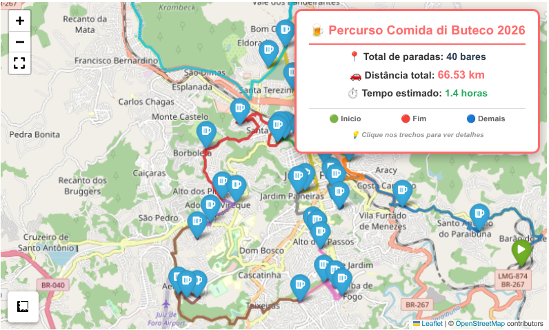

# Descubra o melhor percurso com Python e Osmnx

### Introdução

Para definir o trajeto mais curto em um roteiro hipotético com quarenta bares, reaproveitamos o código originalmente utilizado para os pontos de interesse do circuito turístico [Museu de Percurso Raphael Arcuri](https://github.com/guiajf/roteamento/). Esse código emprega a biblioteca Python **OSMnx**, desenvolvida e mantida por Geoff Boeing, professor de Planejamento Urbano e Análise Espacial da Universidade do Sul da Califórnia (USC).


### Objetivo

Calcular e visualizar a rota mais curta para percorrer todos os bares participantes do concurso [Comida de Buteco 2026 JF](https://github.com/guiajf/comida-di-buteco).

### Importamos as bibliotecas


```python
import pandas as pd
import numpy as np
import osmnx as ox
import folium
from folium.plugins import Fullscreen
from sklearn.neighbors import NearestNeighbors
from shapely.geometry import Point
import warnings
warnings.filterwarnings('ignore')
```

### Carregamos os dados em um DataFrame


```python
gdf = pd.read_csv("lista_bares.csv")
```

### Inspecionamos o DataFrame


```python
gdf[:5]
```


<div>

<table border="1" class="dataframe">
  <thead>
    <tr style="text-align: right;">
      <th></th>
      <th>Name</th>
      <th>longitude</th>
      <th>latitude</th>
      <th>Endereço</th>
      <th>Petisco</th>
      <th>Contato</th>
      <th>Instagram</th>
      <th>Descrição</th>
      <th>Funcionamento</th>
    </tr>
  </thead>
  <tbody>
    <tr>
      <th>0</th>
      <td>ADEGA BAR</td>
      <td>-43.298967</td>
      <td>-21.782000</td>
      <td>Av. Dr. Francisco Álvares de Assis, 490 – Retiro</td>
      <td>Caruru Mineiro</td>
      <td>(32) 98893-1082</td>
      <td>adegawinebar</td>
      <td>Uma fusão da Bahia com Minas: caruru de taioba...</td>
      <td>Terça a sexta – 18h às 23h | Sábado – 12h às 0...</td>
    </tr>
    <tr>
      <th>1</th>
      <td>BAR DIAS</td>
      <td>-43.360996</td>
      <td>-21.736599</td>
      <td>Rua Luís Rocha, 2 – Santa Terezinha</td>
      <td>Sabor de Buteco</td>
      <td>(32) 3224-9914</td>
      <td>bardiasjf</td>
      <td>Nhoque de agrião acompanhado de ragu de rabada...</td>
      <td>Segunda a Sábado – 10h às 23h | Domingo – 10h ...</td>
    </tr>
    <tr>
      <th>2</th>
      <td>BAR DO ABILIO</td>
      <td>-43.347222</td>
      <td>-21.758611</td>
      <td>Rua Fonseca Hermes, 180 – Centro</td>
      <td>Brigadeiro de buteco</td>
      <td>(32) 3215-6216</td>
      <td>bardoabilio</td>
      <td>Bolinho de queijo mussarela e bacon, recheado ...</td>
      <td>Segunda a Sexta – 11h às 22h | Sábado – 11h às...</td>
    </tr>
    <tr>
      <th>3</th>
      <td>BAR DO ANTONIO</td>
      <td>-43.372311</td>
      <td>-21.766567</td>
      <td>Rua José Lourenço, 1262 – São Pedro</td>
      <td>Mostarda, mas não falha</td>
      <td>(32) 98709-0353</td>
      <td>bar.do.antonio</td>
      <td>Cama de angu da roça temperado, rodeado de mos...</td>
      <td>Terça a Quinta – 17h às 23h30 | Sexta – 16h às...</td>
    </tr>
    <tr>
      <th>4</th>
      <td>BAR DO BENE</td>
      <td>-43.378489</td>
      <td>-21.775617</td>
      <td>Rua João Batista Sampaio, 150 – São Pedro</td>
      <td>Deu cupim no agrião</td>
      <td>(32) 98813-6345</td>
      <td>bardobeneoficial</td>
      <td>Bolinho de agrião recheado com cupim ao vinho ...</td>
      <td>Terça – 16h às 22h | Quarta a Sexta – 16h às 2...</td>
    </tr>
  </tbody>
</table>
</div>


```python
gdf.info()
```

    <class 'pandas.core.frame.DataFrame'>
    RangeIndex: 40 entries, 0 to 39
    Data columns (total 9 columns):
     #   Column         Non-Null Count  Dtype  
    ---  ------         --------------  -----  
     0   Name           40 non-null     object 
     1   longitude      40 non-null     float64
     2   latitude       40 non-null     float64
     3   Endereço       40 non-null     object 
     4   Petisco        40 non-null     object 
     5   Contato        40 non-null     object 
     6   Instagram      40 non-null     object 
     7   Descrição      40 non-null     object 
     8   Funcionamento  40 non-null     object 
    dtypes: float64(2), object(7)
    memory usage: 2.9+ KB


### Calculamos a rota mais curta

A classe *NearestNeighbors* do módulo *sklearn.neighbors*, junto com o
algoritmo *ball_tree*, fornece uma solução robusta para problemas de
busca por proximidade, como o do roteamento entre pontos geográficos.

Foi definido um ponto de início (Ponto 0 - ADEGA BAR) e um ponto de término específico (Ponto 5 - BAR DO BREJO). O algoritmo principal (*while*) constrói a rota, adicionando o vizinho mais próximo ainda não visitado até atingir o ponto de destino ou visitar todos os pontos.

A saída mostra a sequência de bares a serem visitados na rota calculada.


```python
# Calcular a distância para cada par de pontos consecutivos
X = np.array(gdf[['latitude', 'longitude']])
bares = gdf['Name']
nbrs = NearestNeighbors(n_neighbors=len(X), algorithm='ball_tree').fit(X)
distances, indices = nbrs.kneighbors(X)

# Encontrar o roteiro mais curto
visited = np.zeros(len(X), dtype=bool)

end_point = 5  # Definindo o ponto final como 5 (Bar do Brejo)

visited[0] = True
tour = [0]
current = 0

# Modificado para parar quando chegar ao ponto 5
while current != end_point and len(tour) < len(X):
    unvisited_mask = np.logical_not(visited[indices[current]])
    if np.any(unvisited_mask):
        nearest = indices[current][unvisited_mask][0].item()
    else:
        # Se todos os vizinhos foram visitados, escolha o próximo não visitado
        unvisited = np.where(visited == False)[0]
        if len(unvisited) > 0:
            nearest = unvisited[0]
        else:
            break
    
    tour.append(nearest)
    visited[nearest] = True
    current = nearest

    # Se chegou ao ponto final, pare
    if current == end_point:
        break

# Resultado
print("Rota mais curta terminando no item 39:")
for i, point in enumerate(tour):
    print(f"{i}. {bares[point]} (Ponto {point})")

```

    Rota mais curta terminando no item 39:
    0. ADEGA BAR (Ponto 0)
    1. RECANTO DOS MANACAS (Ponto 35)
    2. EMPORIO DO SABOR (Ponto 26)
    3. VARANDA RESTO BEER (Ponto 38)
    4. PAPPADOG BAR (Ponto 33)
    5. CAMINHO DA ROCA (Ponto 19)
    6. BAR DO ABILIO (Ponto 2)
    7. SUPER LAZIN (Ponto 37)
    8. CASARAO BAR (Ponto 21)
    9. BAR BATATA D'MOLA (Ponto 14)
    10. BAR DO MARQUIM (Ponto 7)
    11. REZA FORTE (Ponto 36)
    12. INFORMAL BAR & RESTAURANTE (Ponto 29)
    13. BIROSCA BAR E RESTAURANTE (Ponto 15)
    14. BAR DO PASSARINHO (Ponto 8)
    15. ZAKAS GASTRO BEER (Ponto 39)
    16. BAR DO ANTONIO (Ponto 3)
    17. BAR DO JORGE (Ponto 6)
    18. BUTECO DO PRINCIPE (Ponto 17)
    19. BAR DO BENE (Ponto 4)
    20. PETISQUEIRA (Ponto 34)
    21. DON JUAN GASTRONOMIA E EVENTOS (Ponto 25)
    22. BAR DO TIAO (Ponto 9)
    23. BAR TORRESMO (Ponto 10)
    24. IBITIBAR (Ponto 28)
    25. BAR SANTA MODERACAO (Ponto 13)
    26. PAO MOIADO BAR (Ponto 32)
    27. DIRCEUS PUB (Ponto 24)
    28. ESPETINHO DA VILLA (Ponto 27)
    29. BUTIQUIM DA FABRICA (Ponto 18)
    30. BAR DU CHICO (Ponto 12)
    31. CARLOTA (Ponto 20)
    32. BAR DU BUNECO (Ponto 11)
    33. LERO LERO (Ponto 30)
    34. BAR DIAS (Ponto 1)
    35. BUDEGA DO PAPAI (Ponto 16)
    36. COMPADRE GRILL COSTELARIA (Ponto 23)
    37. NOSSO BAR JF (Ponto 31)
    38. COLISEUM BAR (Ponto 22)
    39. BAR DO BREJO (Ponto 5)


### Ordenamos a rota calculada

São criados dicionários para mapear os nomes dos bares às suas coordenadas (*coordenadas_referencia*) e depois ordenados conforme a rota calculada (*coordenadas_ordenadas*).


```python
bares = gdf['Name'].tolist()

coordenadas_referencia = {row['Name']: (row['latitude'], row['longitude'])
                          for idx, row in gdf.iterrows()}

coordenadas_ordenadas = {
    bares[i]: coordenadas_referencia[bares[i]]
    for i in tour
}
```

### Definimos o percurso de carro

Usamos o pacote **OSMnx** para baixar um grafo da rede viária para
veículos automotivos, centrado no primeiro ponto da rota ordenada, com um raio de 20 km (dist=20000).

Em seguida, itera pelos pares de coordenadas consecutivas na rota ordenada.
Para cada par (origem e destino), encontra os nós mais próximos no grafo **OSM** e calcula o caminho mais curto (*ox.shortest_path*) considerando a distância (*weight='length'*).

As distâncias de cada segmento e do caminho completo são acumuladas.
Os nós de todos os segmentos são concatenados em *full_path*, evitando duplicação do nó inicial de um novo segmento se ele for igual ao nó final do anterior.


```python
# Transformar os valores do dicionário em uma lista de tuplas
itinerario = list(coordenadas_ordenadas.values())

# Criar grafo de caminhada ao redor do primeiro ponto
G = ox.graph_from_point(itinerario[0], dist=20000, network_type='drive')

# 2. Criar caminho completo conectando todos os pares consecutivos
full_path = []
distancia_total = 0  # Variável para acumular a distância total

for i in range(len(itinerario) - 1):
    orig_point = itinerario[i]
    dest_point = itinerario[i + 1]
    
    try:
        orig_node = ox.distance.nearest_nodes(G, orig_point[1], orig_point[0])  
        dest_node = ox.distance.nearest_nodes(G, dest_point[1], dest_point[0])
        
        # Obter o caminho mais curto
        segment = ox.shortest_path(G, orig_node, dest_node, weight='length')
        
        # Calcular a distância do segmento
        distancia_segmento = 0
        for j in range(len(segment) - 1):
            node1 = segment[j]
            node2 = segment[j+1]
            distancia_segmento += G[node1][node2][0]['length']
        
        distancia_total += distancia_segmento
        
        # Evitar duplicações de nós
        if full_path and full_path[-1] == segment[0]:
            full_path += segment[1:]
        else:
            full_path += segment
    except Exception as e:
        print(f"Erro ao processar trecho entre {orig_point} e {dest_point}: {e}")

# Obter coordenadas (lat, lon) dos nós do caminho
route_coords = [(G.nodes[n]['y'], G.nodes[n]['x']) for n in full_path]

```

### Definimos o mapa

O mapa **Folium** é inicializado centralizado no primeiro ponto da rota.
Marcadores são adicionados para cada bar na ordem da rota, com ícones diferentes para início (verde), fim (vermelho) e demais (azul com ícone de cerveja).

A rota completa calculada (*route_coords*) é desenhada como uma linha poligonal vermelha no mapa. Um rótulo HTML fixo é adicionado ao mapa mostrando a distância total e o número de paradas. São adicionadas extensões úteis como *MeasureControl*(medição de distâncias) e *Fullscreen*.


```python
# Criar mapa
mapa = folium.Map(location=itinerario[0], zoom_start=15)

# Adicionar pontos do itinerário como marcadores com ícones personalizados
nomes = list(coordenadas_ordenadas.keys())
for idx, (nome, coord) in enumerate(zip(nomes, coordenadas_ordenadas.values())):
    if idx == 0:
        icon_color = 'green'
        icon_name = 'play'
    elif idx == len(coordenadas_ordenadas) - 1:
        icon_color = 'red'
        icon_name = 'stop'
    else:
        icon_color = 'blue'
        icon_name = 'beer'
    
    folium.Marker(
        coord,
        tooltip=nome,
        popup=f"<b>{nome}</b><br>Parada {idx + 1} de {len(coordenadas_ordenadas)}",
        icon=folium.Icon(icon=icon_name, color=icon_color, prefix="fa")
    ).add_to(mapa)

# Adicionar a linha da rota em vermelho
folium.PolyLine(route_coords, color='red', weight=4, opacity=0.8).add_to(mapa)

```


    <folium.vector_layers.PolyLine at 0x7c06408fd700>


### Adicionamos rótulo com percurso total


```python
# Calcular distância total em km
distancia_total_km = distancia_total / 1000

# Estilo do rótulo
distancia_label = f"""
<div style="
    position: fixed; 
    top: 10px; 
    right: 10px; 
    z-index: 1000; 
    background-color: white; 
    padding: 12px 16px; 
    border-radius: 8px; 
    border: 2px solid #ff6b6b; 
    font-family: 'Segoe UI', Arial, sans-serif; 
    font-size: 14px; 
    font-weight: bold; 
    box-shadow: 0 2px 10px rgba(0,0,0,0.2);
    text-align: center;
">
    <div style="color: #ff6b6b; font-size: 16px; margin-bottom: 5px;">🍺 Roteiro completo</div>
    <div>📍 Paradas: {len(coordenadas_ordenadas)} bares</div>
    <div>🚶 Distância total a percorrer: <span style="color: #ff6b6b;">{distancia_total_km:.2f} km</span></div>
    <div style="font-size: 11px; color: #666; margin-top: 5px;">
        🟢 Início | 🔴 Fim | 🔵 Demais bares
    </div>
</div>
"""

# Adicionar o rótulo ao mapa
mapa.get_root().html.add_child(folium.Element(distancia_label))

# Adicionar também uma legenda de distância por trecho (opcional)
detalhes_trechos = """
<div style="
    position: fixed; 
    bottom: 10px; 
    left: 10px; 
    z-index: 1000; 
    background-color: white; 
    padding: 10px; 
    border-radius: 8px; 
    border: 1px solid #ccc; 
    font-family: 'Segoe UI', Arial, sans-serif; 
    font-size: 11px; 
    box-shadow: 0 1px 5px rgba(0,0,0,0.1);
    max-width: 200px;
">
    <b>📏 Distâncias por trecho:</b><br>
"""

# Adicionar ferramentas úteis
from folium.plugins import MeasureControl, Fullscreen
MeasureControl().add_to(mapa)
Fullscreen().add_to(mapa)

```


    <folium.plugins.fullscreen.Fullscreen at 0x7c06408c7530>


### Visualizamos o mapa


```python
display(mapa)
```


**Considerações finais:**

O cenário proposto é um exercício prático e não uma sugestão realista de itinerário, dado que o propósito pedagógico por trás da análise é o aprendizado e aplicação de conceitos e ferramentas para resolver um problema complexo como o **TSP** (*Traveling Salesman Problem*), embora, nesse caso, sem a garantia de solução ótima. Por fim, o projeto conecta a atividade prática realizada, que consiste em calcular uma rota entre pontos, ao conceito teórico da **TSP** e à construção da rota final.

**Referências:**

Boeing, G. (2025). Modeling and Analyzing Urban Networks and Amenities
with OSMnx. Geographical Analysis, published online ahead of print.
<doi:10.1111/gean.70009>

SCIKIT-LEARN. User Guide: Nearest Neighbors. 2025. Disponível em:
<https://scikit-learn.org/stable/modules/neighbors.html>. Acesso em: 18
JUN 2025.

